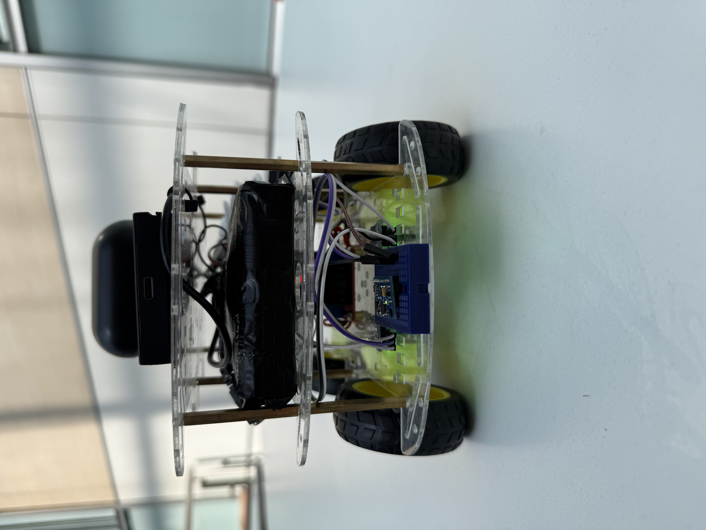

# TOBB ETÜ ELE495 - Capstone Project

# Table of Contents
- [Introduction](#introduction)
- [Features](#features)
- [Installation](#installation)
- [Usage](#usage)
- [Screenshots](#screenshots)
- [Acknowledgements](#acknowledgements)

## Introduction
This project focuses on developing an autonomous mini vehicle capable of understanding and executing Turkish voice commands given in natural language. It combines speech recognition, natural language processing, and microcontroller-based motion control to enable the system to interpret user instructions and respond with appropriate movements. The importance of this project lies in its potential applications in voice-controlled robotics, smart mobility systems, and human-machine interaction in Turkish-speaking contexts. As an outcome, it can contribute to advancements in localized AI systems, enhance accessibility, and serve as a foundation for more complex autonomous systems.

Moreover, mini vehicle provides voice during the actions which is called as text-to-speech (TTS) API. Real-time voice feedback is also in natural toned, Turkish language. 
Mini vehicle separates the commands according to it’s capacity and abilities. It responds to convenient commands with proper actions and voice. If command is inconvenient for requirements and abilities, vehicle states that circumstance. Raspberry PI 4 microcontroller is used for web applications, real-time status display, recognized speech, translated commands, and action history. An interface is developed for presentation of these applications. It is equipped with Wi-Fi communication. Therefore, standard communication protocol TCP is used. In addition, GPT AI Service is used for command interpretation. Manufacturing budget is constrained with 20.000 TL.

## Features

### Hardware Components

- [Raspberry Pi 4 Model B - 4GB](https://robolinkmarket.com/raspberry-pi-4-model-b-4gb)
- [L298N Motor Driver](https://robolinkmarket.com/l298n-motor-surucu-karti)
- 4x [DC Motors with Wheels](https://robolinkmarket.com/motor-ve-tekerlek-seti)
- [MPU6050 IMU Sensor](https://robolinkmarket.com/mpu6050-ivme-ve-gyro-sensor-karti)
- [HC-SR04 Ultrasonic Sensors](https://robolinkmarket.com/hc-sr04-arduino-ultrasonic-mesafe-sensoru)
- [USB Microphone](https://www.trendyol.com/torima/2-adet-kablosuz-yaka-mikrofonu-typ-c-2-li-mini-mikrofon-k9-p-341885980?boutiqueId=61)
- [USB Speaker](https://www.trendyol.com/odseven/raspberry-pi-icin-mini-harici-usb-stereo-hoparlor-p-353442163)
- [Wi-Fi Router](https://www.vatanbilgisayar.com/tenda-mf3-150mbps-4g-lte-tasinabilir-kablosuz-n-router.html)
- 4x [Lithium-Ion 21700 cells](https://robolinkmarket.com/tenpower-inr21700-50me-37v-5000-mah-li-ion-sarjli-pil-147a)
- [Powerbank](https://www.vatanbilgisayar.com/anker-321-maggo-5-000mah-manyetik-powerbank-beyaz.html)
- [Micro SD Card for Raspberry](https://www.vatanbilgisayar.com/samsung-evo-plus-64-gb-adaptorlu-hafiza-karti-160mb-s.html)
- 4x [IR Speed Sensor](https://www.ubuy.com.tr/tr/product/5H92RF6-daoki-5pcs-speed-measuring-sensor-ir-infrared-slotted-optical-optocoupler-module-photo-interrupter-sensor-for-motor-speed-detection-or-arduino-with-en?ref=hm-google-redirect)
- [4S BMS](http://robolinkmarket.com/4wd-cok-amacli-mobil-robot-platformu-seffaf)
- 2x [Mobile Vehicle Platform](https://robolinkmarket.com/4wd-cok-amacli-mobil-robot-platformu-seffaf)
  
### Operating System & Software Stack
- **OS:** [Raspbian OS (Lite)](https://www.raspberrypi.com/software/) 
- **Language:** Python 3.10
- **Core Libraries:**
  - `resemblyzer`, `gTTS`, `pygame`
  - `openai`, `requests`, `pydantic`
  - `numpy`, `RPi.GPIO`, `pigpio`, `smbus2`
  - Optional: `Flask` for UI integration

### System Modules
- `main.py` – Main orchestrator for the control flow
- `speech_io.py` – Voice input, Whisper transcription, GPT-4 text correction, and audio feedback
- `speaker_verification.py` – Uses Resemblyzer for speaker embedding extraction and cosine similarity to verify if the speaker matches any of the registered users
- `command_parser.py` – Converts speech text to structured JSON commands via GPT-4
- `robot_executor.py` – Executes structured commands (e.g., move, turn, wait)
- `controller.py` – GPIO motor control and PID regulation
- `sensors.py` – Manages IMU, ultrasonic sensors, and wheel encoders
- `kalman_filter.py` – 1D Kalman filter for position and velocity estimation

### Services

- **[OpenAI Whisper & GPT-4](https://openai.com/tr-TR/index/whisper/):**  
  - Whisper transcribes speech to Turkish text  
  - GPT-4 parses commands into structured JSON actions
- **Socket-Based UI Communication:**  
  - Real-time status logs and command updates sent to a UI over TCP
- **[Voice Feedback System](https://cloud.google.com/text-to-speech):**  
  - gTTS and speaker output for interactive Turkish responses


## Installation
### Assembly Instructions

1. **Chassis Setup:**
   - Mount the 4 DC motors onto the two-layer mobile vehicle platform using the provided brackets and screws.
   - Attach the wheels securely to the motors.
   - Fix the L298N motor driver onto the chassis using double-sided tape or screws.

2. **Motor Wiring:**
   - Connect each motor’s wires to the L298N output terminals. Connections of keft and right motor's wires are in the same terminal. (OUT1–OUT4).
   - Connect ENA, ENB, IN1–IN4 pins of L298N to Raspberry Pi GPIOs (refer to `controller.py` for the specific pins).

3. **Battery and Power Management:**
   - Connect 4x 21700 Lithium-Ion cells to the 4S BMS circuit.
   - Use a step-down voltage regulator (optional) to safely power the L298N and motors.
   - Power the Raspberry Pi using the Powerbank via USB-C.

4. **Sensor Installation:**
   - **MPU6050 IMU**: Connect via I2C (SDA/SCL) pins to Raspberry Pi (usually GPIO 2 and 3).
   - **HC-SR04**: Mount on the front of the vehicle, and connect TRIG and ECHO pins to GPIO (e.g., 5 and 6).
   - **IR Speed Sensors**: Position each sensor near a motor's wheel encoder for speed measurement. Connect signal pins to GPIO (e.g., 17 and 18).

5. **Audio Interface:**
   - Plug in the USB microphone and USB speaker into Raspberry Pi’s USB ports.
   - Ensure the microphone is configured as the default audio input device.

6. **Wi-Fi & Connectivity:**
   - Set up the portable Wi-Fi router and connect the Raspberry Pi to its network.
   - This allows remote access to the logging interface and command control.

7. **Final Touches:**
   - Insert the microSD card into the Raspberry Pi with the pre-installed OS and project files.
   - Secure all wiring using zip ties and ensure no loose connections.
   - Power on the system and verify all components are functional (motors spin, audio works, sensors respond).

> Tip: Before final deployment, test each module (motors, IMU, ultrasonic, encoder) individually using provided test scripts to ensure proper wiring and functionality.

### Resemblyzer Speaker Embedding Setup

To ensure that only authorized users can control the vehicle, this project uses **Resemblyzer**, an open-source speaker embedding library. Each group member is registered by computing an average embedding from multiple audio samples.

### Steps to Create Speaker Embeddings

1. **Install Resemblyzer**:
```bash
pip install resemblyzer
 ```
2. **Prepare your dataset**:
   Create a folder structure like below:
  ```
kayitli_sesler_mono/
    ├── eda/
    │   ├── eda1.wav
    │   ├── eda2.wav
    ├── emre/
    │   ├── emre1.wav
    │   ├── emre2.wav
    ...

  ``` 
3. **Run the following script to compute average embeddings per speaker**:

```python
from resemblyzer import VoiceEncoder, preprocess_wav
from pathlib import Path
import numpy as np
import pickle

# Load the encoder model
encoder = VoiceEncoder()

# Directory containing subfolders for each speaker
DATA_DIR = Path("kayitli_sesler_mono")
speaker_embeddings = {}

# Calculate average embedding per speaker
for speaker_dir in DATA_DIR.iterdir():
    if speaker_dir.is_dir():
        embeddings = []
        for wav_file in speaker_dir.glob("*.wav"):
            wav = preprocess_wav(wav_file)
            emb = encoder.embed_utterance(wav)
            embeddings.append(emb)
        if embeddings:
            speaker_embeddings[speaker_dir.name] = np.mean(embeddings, axis=0)

# Save embeddings
with open("saved_embeddings.pkl", "wb") as f:
    pickle.dump(speaker_embeddings, f)

print("✅ Average embeddings saved for each speaker.")

 ```
4. **Output**:

A file named `saved_embeddings.pkl` will be created. This file contains the average voice embeddings of all registered users and will be used for real-time speaker verification.
   
### Software Installation on Raspberry Pi

This section describes how to set up the software environment on your Raspberry Pi 4 to run the autonomous mini vehicle system.
**Prerequisites**:  

- Raspberry Pi 4 (4GB or higher)
- A fresh installation of Raspberry Pi OS
- Stable internet connection (via Wi-Fi or Ethernet)
- A USB keyboard and HDMI monitor (for first-time setup, or use SSH)
---

1. **Clone the Repository**:  

Open a terminal on your Raspberry Pi and run:

```bash
git clone https://github.com/username/autonomous-vehicle-nlp.git
cd autonomous-vehicle-nlp
```
2. **Update the System**:

```bash
sudo apt update && sudo apt upgrade -y
```
3. **Install System Dependencies**:
   
These packages are required for audio processing, GPIO access, and I2C communication:
```bash
sudo apt install python3-pip python3-pyaudio python3-dev espeak \
libportaudio2 libatlas-base-dev libffi-dev libnss3 libgpiod-dev \
flac sox ffmpeg libsndfile1
```
4. **Install System Dependencies**:
   
Install Python packages listed in `requirements.txt:`

```bash
pip3 install -r requirements.txt
```

 5. **Install System Dependencies**:

Export your OpenAI and Azure credentials (add these to .bashrc or .profile to persist across reboots):
```bash
export OPENAI_API_KEY="Set Environment Variables"
echo 'export OPENAI_API_KEY="your-openai-key"' >> ~/.bashrc
```
 6. **Transferring `saved_embeddings.pkl` to Raspberry Pi**:
    
If you have pre-trained speaker embeddings saved locally as `saved_embeddings.pkl`, you need to transfer this file to your Raspberry Pi so the system can recognize speakers offline or speed up verification.
```bash
scp saved_embeddings.pkl pi@192.168.x.x:~/autonomous-vehicle-nlp
```
    
 7. **Run the System**:

Once everything is configured, start the system using:

```bash
python3 main.py
```

### User Interface (UI) Configuration

This project includes a custom **Tkinter-based desktop GUI** that allows users to monitor and control the autonomous vehicle in real time. The interface connects to the Raspberry Pi over **SSH and TCP**, enabling both control and feedback.
Before running the UI, ensure the following Python packages are installed on your **local machine (not Raspberry Pi)**:

```bash
pip install paramiko matplotlib tkinter
```
In the UI script, update the following parameters to match your Raspberry Pi:

```python
RASPBERRY_IP = "192.168.x.x"        # your Raspberry Pi IP address
RASPBERRY_USER = "bitirme"          # username on the Pi
RASPBERRY_PASS = "xxxx"             # password for SSH login
REMOTE_MAIN_PATH = "~/autonomous-vehicle-nlp/main.py"  # full path to main.py on Pi
```
**Run the UI**:

Run the UI script from your **local computer**:
```bash
python3 ui.py
```
Bu işlem şunları yapar:
- Open a full-screen dashboard
- Wait for TCP logs from the Raspberry Pi
- Start/stop main.py on the Pi remotely via SSH

## Usage

Once the hardware and software setup is complete, you can start using the system as follows:

---

### Step 1: Power On the Vehicle

- Turn on the Raspberry Pi and ensure it’s connected to the same Wi-Fi network as your computer.
- The motors, sensors, and speaker should all be correctly wired and powered via the battery system or powerbank.

---

### Step 2: Launch the Desktop Interface (on your PC)

From your local machine, run:

```bash
python3 interface.py
```

This will open the **autonomous vehicle control dashboard** as shown below:


**Key UI Components:**

-  **Start / Stop / Reset** buttons (top):  
  Used to remotely control `main.py` on the Raspberry Pi via SSH.

-  **Command Eligibility Indicator (center top)**:  
  Shows whether the system is ready to accept voice commands (`🟢 Komut Verilebilir`) or not (`🔴 Komut Verilemez`).

- **Speaker Buttons (center)**:  
  Highlights who gave the last valid command.

-  **Command Logs (middle)**:  
  - `Komut Durumu:` — internal status  
  - `Sesli Verilen Komut:` — transcription result from Whisper  
  - `Araca Verilen Komut:` — parsed and executed JSON command  
  - `Araç Durumu:` — active task such as "moving forward", "waiting", or "turning"

-  **Görev Geçmişi (left panel)**:  
  A scrollable log of all previously executed commands.

-  **Araç Haritası (right panel)**:  
  Displays the robot’s orientation (yaw) and estimated forward position based on Kalman filtering.

---

###  Step 3: Give Voice Commands

1. Speak in **Turkish** when prompted (e.g., "3 metre ileri git", "90 derece sola dön", "5 saniye bekle").
2. The system will:
   - Verify the speaker via Azure
   - Transcribe the command with Whisper
   - Parse the command via GPT-4
   - Send it to the robot for execution
3. Feedback will be shown on the UI and played through the speaker.

---

### 📡 Real-Time Data Flow

- **main.py** on Raspberry Pi listens to microphone input and handles command logic.
- It sends status logs to the desktop UI via TCP port **5050**.
- It sends orientation and location data (yaw + distance) to the UI via port **5051**.

---

> ⚠️ Make sure `main.py` is running on the Raspberry Pi, and that your firewall allows connections on ports **5050** and **5051**.  
> The Raspberry Pi must be connected to the **same network** as your PC.


## 📸 Screenshots

Below are real-life images of the autonomous vehicle:




---

### ▶️ Project Demonstration

Watch the full video demonstration on YouTube:

[](https://www.youtube.com/watch?v=VIDEO_ID_HERE](https://www.youtube.com/playlist?list=PLqFjsYCwdxEC5kf304XevFjM9bchKAfnd))


## Acknowledgements
We would like to thank the faculty and coordinators of the ELE 495 Senior Design course at TOBB University of Economics and Technology for their continuous guidance and support.Special thanks to the Dr. Ali Murat Demirtaş, Dr. Zeki Kocabıyıkoğlu and assistants for providing the tools and infrastructure required for successful prototyping and testing.

### • Contributors
- [Celal Bülent Cengiz](https://github.com/cbc15102)
- [Eda Koç](https://github.com/edakoc22)
- [Hasan Gökhan Okcuoğlu](https://github.com/GokhanOkcuoglu)
- [İbrahim Emre Yerli](https://github.com/ieyerli)

  ### • Resources and Tools
- [Raspberry Pi Foundation](https://www.raspberrypi.org/) – for the development board and GPIO ecosystem  
- [OpenAI Whisper](https://platform.openai.com/docs/guides/speech-to-text) & [GPT-4](https://platform.openai.com/docs/guides/gpt) – for Turkish speech transcription and natural language command parsing  
- [Resemblyzer](https://github.com/resemble-ai/Resemblyzer) – for speaker verification using voice embeddings  
- [gTTS](https://pypi.org/project/gTTS/) – for Turkish text-to-speech audio feedback  
- [Pygame](https://www.pygame.org/news) – for playing TTS audio responses  
- [RPi.GPIO](https://sourceforge.net/p/raspberry-gpio-python/wiki/Home/) & [pigpio](http://abyz.me.uk/rpi/pigpio/) – for motor and encoder control via GPIO  
- [smbus2](https://pypi.org/project/smbus2/) – for I2C communication with MPU6050 IMU  
- [Tkinter](https://docs.python.org/3/library/tkinter.html) – for creating the desktop user interface  
- [Matplotlib](https://matplotlib.org/) – for GUI-based map and telemetry visualizations  
- [Paramiko](https://www.paramiko.org/) – for remote SSH control of the Raspberry Pi  
- [NumPy](https://numpy.org/) – for Kalman filtering and numerical operations  
- [SpeechRecognition](https://pypi.org/project/SpeechRecognition/) – for local microphone recording and audio input control  
- [FFmpeg](https://ffmpeg.org/) – for audio format compatibility (used by Whisper and gTTS)  
